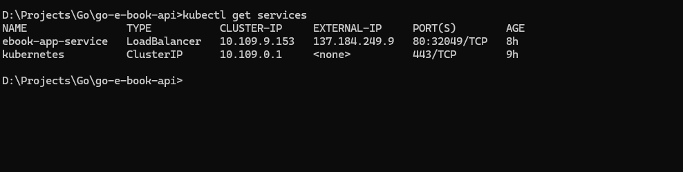
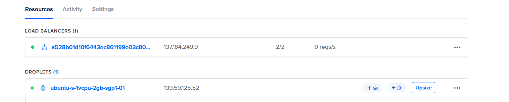
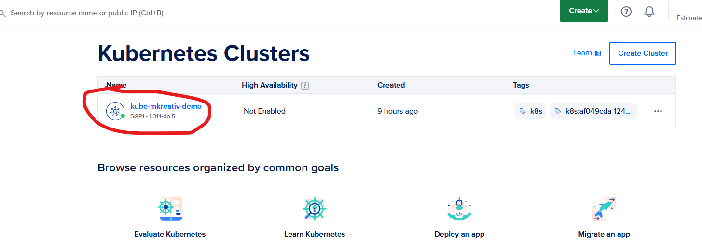

# Articulos

Section where related documents are stored

---

### Propose the solutions using words and diagrams. Recommendation on how to deliver solutions that can solve the problem state.

-- All the given 3 solutions implemented a two-layer components. A front-end and back-end. For the reason that that if the application scales, either vertical/horizontalor  on-premise or cloud,  we do not have a tight monolithic  design that we have to dismantle.

### Explain the difference between client-side rendering and server-side rendering.
-- In within a simple and pragmatic note. Client side rendeing generally processes within the browser level. While Servser- side motions every rendering process serverside firswt then pasees on to render.

-- Examples for CSR's are ( Javascript)
-- Examples for SSR's are (Most of these are Java based. Samples would be ZKoss and Vaadin )

### Justify your technology stack, libraries, router framework, and UI components.
-- Provided 3 implementations for a broad comparison. A React-JS + Java would be best. But a Nodejs + React is the lightest 

### Use PlantUML / or equivalent tools to create representations of the Use-Case Diagram, Component Diagram, and Deployment Diagram
-- Kindly see the pdf file ""

### Site URL's

- [Normal JS as front - NodeJS as API](http://139.59.125.52:9990/) 
- [reactJS JS as front - Java SptringBoot as API](http://139.59.125.52:9991/) 
- [reactJS JS as front - Go as API within CLoud Kubernetes cluster ](http://139.59.125.52:9992/) 

### API Base URL (Book)

- [NodeJS API](http://139.59.125.52:8880/api/books) 
- [Java SptringBoot API](http://139.59.125.52:8882/api/books) 
- [Go as API within Digital Cloud Kubernetes cluster ](http://137.184.249.9/api/books) 

## Digital Cloud 

### Additionally, kindly provide feedback in writing, of recommendations on how this assessment & questions could be improved.
-- All were fine and well. Thank you.

